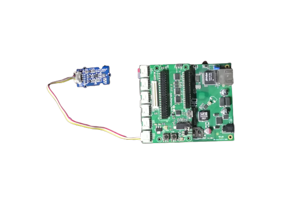

# Sensor Cluster using 96Boards Avenger96

The Sensor cluster project demonstrates the heterogeneous capabilities
of the 96Boards Avenger96 board based on STM32MP1 SoC. In this demo, the
Zephyr RTOS running on the Cortex M4 core of Avenger96 collects data
from the sensors and send it to Linux running on the Cortex-A7 core using
OpenAMP in realtime.

# Table of Contents
- [1) Hardware](#1-hardware)
   - [1.1) Hardware Requirements](#11-hardware-requirements)
   - [1.2) Hardware Setup](#12-hardware-setup)
- [2) Software](#2-software)
   - [2.1) Operating System](#21-operating-system)
   - [2.2) Update Devicetree](#22-update-devicetree)
- [3) Building and running](#3-building-and-running)
- [4) Expected Output](#4-expected-output)

# 1. Hardware

## 1.1 Hardware Requirements:

1. [Avenger96-v100](https://www.96boards.org/product/avenger96/)
> Note: v200 board needs some modifications to the zephyr code for working
2. [Power Supply](https://www.amazon.com/Adapter-Regulated-Supply-Copper-String/dp/B015G8DZK2)
3. [Audio Mezzanine](https://www.96boards.org/product/audio-mezzanine/)
4. [Grove IMU 10 DOF Sensor](http://wiki.seeedstudio.com/Grove-IMU_10DOF/)

## 1.2 Hardware setup:

- Make sure the Avenger96 is powered off
- Connect Audio Mezzanine on top of Avenger96
- Set switch SW1 to ON position on the Audio Mezzanine
- Connect IMU 10 DOF sensor to I2C_1 port of Audio Mezzanine
- Connect HDMI display and USB keyboard to Avenger96



- Power on the board using 96Boards CE power supply

# 2. Software

## 2.1 Operating System

Install OpenSTLinux distribution on Avenger96 as per below wiki:
https://wiki.dh-electronics.com/index.php/Avenger96

## 2.2 Update Devicetree

The Linux kernel devicetree needs to be updated for this demo. The I2C1
port to be used by the M4 core needs it to be disabled for A7 core. So,
the devicetree needs to be updated to disable the I2C1 port.

This can be achieved using the [dtc](https://git.kernel.org/pub/scm/utils/dtc/dtc.git)
utility as below:

```shell
$ cd /media/${USER}/bootfs
$ dtc -I dtb -O dts stm32mp157a-av96.dtb > stm32mp157a-av96.dts
```
Now, disable the `i2c@40012000` node, with `status = "disabled"` property.

```shell
$ dtc -O dtb -o stm32mp157a-av96.dtb stm32mp157a-av96.dts
```

# 3. Building and running

#### Setup Zephyr environment

Setup Zephyr environment as per below guide:
https://docs.zephyrproject.org/latest/getting_started/index.html

#### Update Zephyr modules

OpenAMP module in Zephyr needs to be updated as below:

```
$ cd zephyrproject/modules/lib/open-amp
$ git remote add arno https://github.com/arnop2/open-amp-1
$ git fetch arno
$ git cherry-pick 28cc6fb3023f4c8827636156b3fce2627b47f882
	(resource table: add helper to add resource table in project.)
$ git cherry-pick aead88f6edb8f5cac47b6ba441fbecef0bbd38bf
	(remoteproc: fix compilation warning in elf loader)
```

> Note: The relevant SHA1 of the above change needs to be updated in
> `zephyrproject/zephyr/west.yml` under `open-amp/revision` in `avenger96-demo`
> branch. Please see the commit,
> **TEMP: Configure west to use OpenAMP resource table change** for reference.

#### Switch to Demo Zephyr branch

Now, fetch and switch to the demo zephyr branch as below:

```
$ git remote add mani https://github.com/Mani-Sadhasivam/zephyr.git
$ git fetch mani
$ git checkout -t mani/avenger96-demo
```

#### Building and Running

```
$ rm -rf build
$ west build -b 96b_avenger96 samples/boards/96b_avenger96/sensor_cluster
```

Now, copy the built binary `avenger96_sensor_cluster.elf` to `/lib/firmware` directory of the `rootfs` partition of Avenger96 board.

For running the demo, execute below commands in the shell of Avenger96
OpenSTLinux distro:

```
$ ./fw_cortex_m4.sh start
$ ./start_tty.sh
$ cat /dev/ttyRPMSG0
```

# 4. Expected Output

```
$ ./fw_cortex_m4.sh start
fw_cortex_m4.sh: fmw_name=avenger96_sensor_cluster.elf
[   39.990110] remoteproc remoteproc0: powering up m4
[   40.043902] remoteproc remoteproc0: Booting fw image avenger96_sensor_cluster.elf, siz0
[   40.055804] rproc-srm-core m4@0:m4_system_resources: bound m4@0:m4_system_resources:m40
[   40.074684] virtio_rpmsg_bus virtio0: rpmsg host is online
[   40.074785] virtio_rpmsg_bus virtio0: creating channel rpmsg-tty-channel addr 0x0
[   40.081635]  m4@0#vdev0buffer: registered virtio0 (type 7)
[   40.087234] rpmsg_tty virtio0.rpmsg-tty-channel.-1.0: new channel: 0x400 -> 0x0 : ttyR0
[   40.092445] remoteproc remoteproc0: remote processor m4 is now up
$ ./start_tty.sh 
$ cat /dev/ttyRPMSG0 
96Boards Avenger96 Sensor Cluster:
MPU9250: Accel ( x y z ) = ( -0.184354  5.801150  7.857769 )
MPU9250: Gyro ( x y z ) = ( 0.000133  0.013456  0.045964 )
BMP180: Temperature: 30.0 C
```
